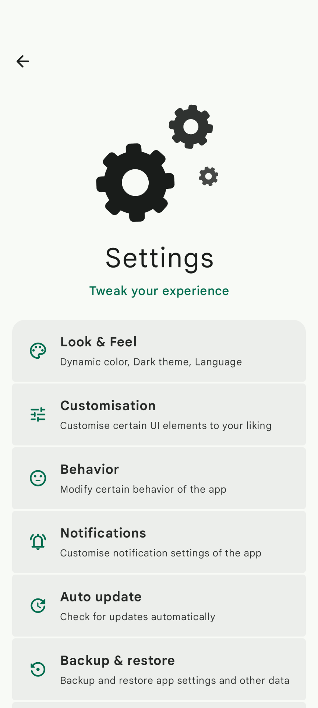

<p align="center">
  
</p>

> **Driftly** is a fully-featured **Attendance Tracker** app with **Material Design 3 UI**, letting you save your daily attendance and analyze them, packed in a beautiful and smart interface

</br>

<p align="center"> 
<a href="https://github.com/DP-Hridayan/Driftly/stargazers">
    
  </a>
  <a href="https://github.com/DP-Hridayan/Driftly/forks">
    
  </a>
  <a href="https://github.com/DP-Hridayan/Driftly/issues">
    
  </a>
  <a href="https://github.com/DP-Hridayan/Driftly/releases">
    
  </a>
  <a href="https://shields.rbtlog.dev/in.hridayan.driftly">
    
  </a>
  <a href="https://github.com/DP-Hridayan/Driftly/releases">
    
  </a>
  <a href="https://github.com/DP-Hridayan/Driftly/graphs/contributors">
    
  </a>
  <a href="https://github.com/DP-Hridayan/Driftly/blob/main/LICENSE">
    
  </a>
</p>

<p align="center"> 
    
  
  
    
  
  
  
  
    <a href="https://crowdin.com/project/driftly">
    
</a>
</p>

</br>

<h2 align="center">Screenshots</h2>
  <div align="center">
  
  
  
  <br/>
  
  
  
  <br/>
</div>

</br>

## Features

🎨 **Modern Material Design 3 UI**  
> Experience a clean, smooth, and responsive user interface built with Material You, adapting to your device's wallpaper and theme settings.
</br>

📲 **Save attendance**  
> Save attendance for any subject
</br>

🕵️ **Summarization**  
> Get a summary of present, absent or total attendance counts per subject or overall
</br>

🗓️ **Inbuilt Calendar**  
> Built-in Calendar for freely browsing your attendance through months and years
</br>

🛠️ **Support for Adding, Deleting or Editing** 
> Easily add, delete or edit subjects for attendance
</br>

🌑 **AMOLED-Friendly Dark Theme**  
> Includes a sleek dark mode designed to save battery and look great on AMOLED screens
</br>

🎉 **Packed with Extras**  
> Tons of small but useful features to enhance your experience

</br>

## Resources & Links

<p align="start">
<a href="https://github.com/DP-Hridayan/Driftly/releases/latest/">
    
  </a>
  &nbsp;&nbsp;
  <a href="https://apt.izzysoft.de/fdroid/index/apk/in.hridayan.driftly">
    
  </a>
</p>
<p <p align="start">
  <a href="https://t.me/hridayan">
    
  </a>
</p>
<p align="start">
  <a href="https://www.buymeacoffee.com/Hridayan">
    
  </a></p>

  </br>

  ## Translations

<p align="start">
  <picture>
    <source media="(prefers-color-scheme: dark)" srcset="docs/translations-dark.svg?ts=1755348226">
    <source media="(prefers-color-scheme: light)" srcset="docs/translations-light.svg?ts=1755348226">
    
  </picture>
</p>

>[!NOTE]
>
> Help us make this project accessible to more people by contributing translations on **[Crowdin](https://crowdin.com/project/driftly)**
>
> Thanks to our Crowdin [translators](docs/translators.md)

</br>


## License

```
Designed and developed by DP Hridayan @2025
This project is licensed under the GNU General Public License v3.0
```
>[!NOTE]
>
>Full license copy [here](LICENSE.md)

</br>

## Contributors
<a href="https://github.com/dp-hridayan/driftly/graphs/contributors">
  
</a>
</br>
